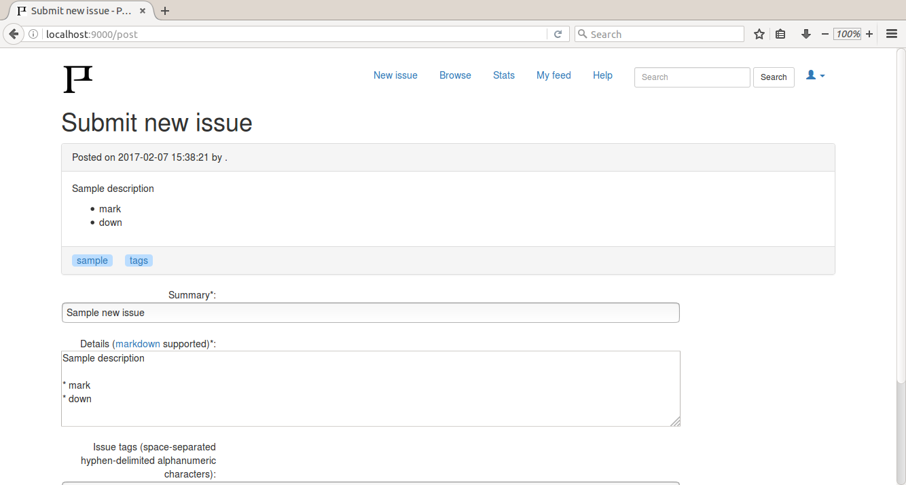

# NAME

Potracheno is a specialized issue tracker for sizing tech debt impact.

*Potracheno* is a Russian adjective with a literal meaning between
*wasted* and *spent*.
It became a local meme after being incorrectly used in
*GTA* game death scene localization.

# DESCRIPTION

Just like a normal ITS, Potracheno has issues, which in turn have comments and
time tracking facility.
However, instead of tracking time spent on *resolving* an issue,
it tracks time wasted *living with it*.

This is supposed to help track down the exact tech debt instances
that slow down and demotivate the team.

Features:

* users, issues, comments, and time tracking (like in a normal ITS);

* markdown support (with *<*code*>*...*<*/code*>*)
for issues & comments, editing issues;

* solution proposals with time estimate;

* issue tags similar to those on Stackoverflow;

* report showing issues with various properties;

* report showing solutions that take less time then
wasted on corresponding issues;

* watching issues & in-app activity stream;

* issue & comment search (SLQ-based, search engine planned);

* DB migration script; MySQL, sqlite support.

Planned:

* versioned editing of comments & issues;

* comment replies.

# SOME SCREENSHOTS

## Issue preview

# INSTALLATION

* Download and unpack this software at
https://codeload.github.com/dallaylaen/potracheno/zip/master,
or just clone:

    git clone https://github.com/dallaylaen/potracheno.git

* Install dependencies:

    cpanm DBD::SQLite Text::Markdown MVC::Neaf

* Run the setup script:

    perl Install.PL --install

* Start the software:

    plackup bin/potracheno.psgi

## NOTES

* If you use ActivePerl, the following command needs to be used instead of cpanm:

     ppm.bat install CGI Plack JSON-XS DBD-SQLite Template-Toolkit Text-Markdown

This may be an overkill, but at least it works.

Then, download Neaf at https://codeload.github.com/dallaylaen/perl-mvc-neaf/zip/master
(MVC::Neaf not currently available through ppm)
and unpack `lib` from Neaf package into `local\\lib`

* If you use a Unix-like OS, init-script called `Start.PL`
is also at your service.

All commands in the package accept `--help` option, so don't hesitate to use it.

## Install.PL

The `Install.PL` command will:

* check for missing dependencies;

* create a `local` directory;

* install latest `MVC::Neaf` from github *locally*,
unless such library is already available;

* create a default configuration file at local/potracheno.cfg,
unless it's already there;

* create an empty SQLite DB from template in `sql` directory,
unless a previous config was detected, or database already exists.

If **sqlite** which comes by default is not enough due to high load or other
reasons, a **MySQL** DB scheme is also available in `sql/` directory, as well
as a DB migration script (`bin/migrate --help`).
Postgresql support is planned in the future. Patches welcome.

Please see file `help/config.md` for configuration & troubleshooting options.

# DEPENDENCIES

* MVC::Neaf (also available from
[github](https://github.com/dallaylaen/perl-mvc-neaf))

* DBD::SQLite

* Text::Markdown

# BUGS

Lots of them. This product is still under heavy development, see TODO.

Please report any bugs or feature request to
https://github.com/dallaylaen/potracheno/issues

# COPYRIGHT AND LICENSE

Copyright 2016 [Konstantin S. Uvarin](https://github.com/dallaylaen).

This program is free software available under the same terms as Perl itself.
